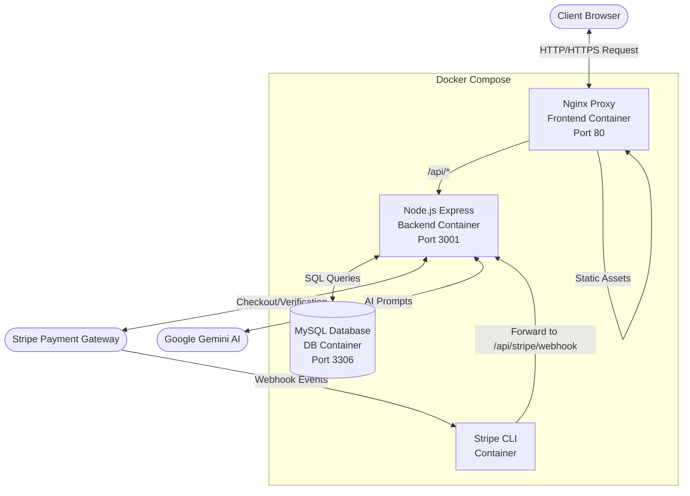
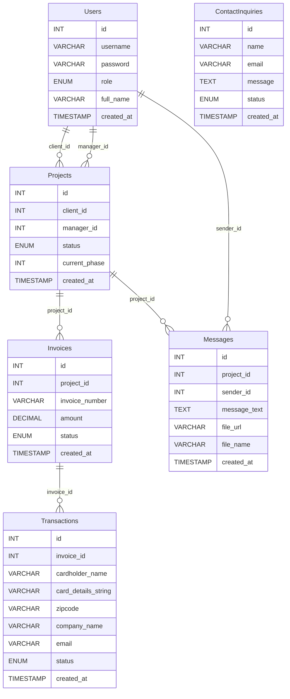
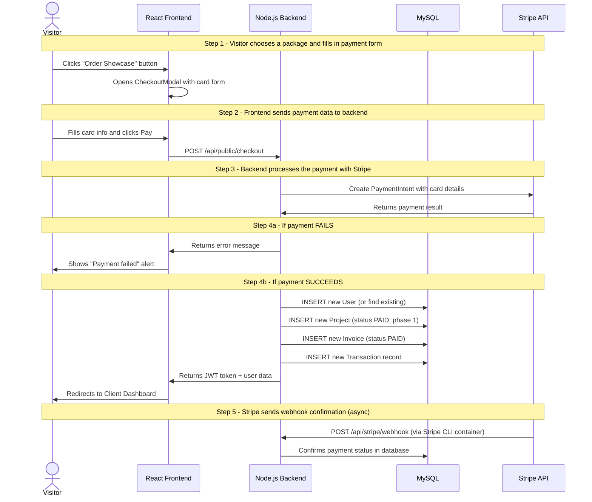
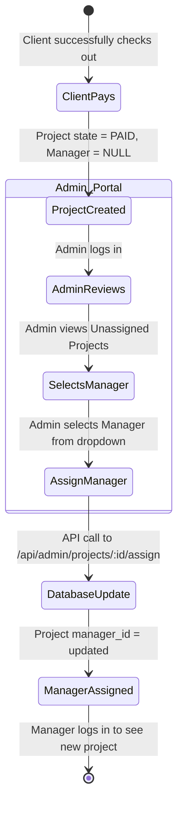
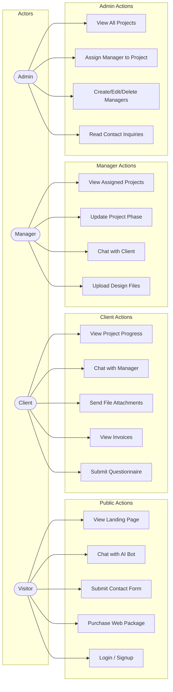

# YTECH Solutions Web App - UML & Architecture Analysis

This document provides a comprehensive architectural and UML analysis of the YTECH Solutions application.

## 1. System Architecture (Component Diagram)

This diagram illustrates the high-level Dockerized architecture and how the frontend, backend, database, and external services interact.

---

## 2. Entity-Relationship (ER) Diagram

This diagram maps out the structure and relationships of the MySQL database.

### ER Table Details

| Table | Column | Type | Constraint |
|-------|--------|------|-----------|
| **Users** | id | INT | PRIMARY KEY, AUTO_INCREMENT |
| | username | VARCHAR(255) | UNIQUE, NOT NULL |
| | password | VARCHAR(255) | NOT NULL |
| | role | ENUM | CLIENT, MANAGER, ADMIN |
| | full_name | VARCHAR(255) | |
| | created_at | TIMESTAMP | DEFAULT CURRENT_TIMESTAMP |
| **Projects** | id | INT | PRIMARY KEY, AUTO_INCREMENT |
| | client_id | INT | FOREIGN KEY → Users(id) |
| | manager_id | INT | FOREIGN KEY → Users(id), NULLABLE |
| | status | ENUM | PENDING, PAID, IN_PROGRESS, COMPLETED |
| | current_phase | INT | DEFAULT 0 |
| | created_at | TIMESTAMP | DEFAULT CURRENT_TIMESTAMP |
| **Invoices** | id | INT | PRIMARY KEY, AUTO_INCREMENT |
| | project_id | INT | FOREIGN KEY → Projects(id) |
| | invoice_number | VARCHAR(255) | UNIQUE, NOT NULL |
| | amount | DECIMAL(10,2) | NOT NULL |
| | status | ENUM | UNPAID, PAID |
| | created_at | TIMESTAMP | DEFAULT CURRENT_TIMESTAMP |
| **Transactions** | id | INT | PRIMARY KEY, AUTO_INCREMENT |
| | invoice_id | INT | FOREIGN KEY → Invoices(id) |
| | cardholder_name | VARCHAR(255) | |
| | card_details_string | VARCHAR(255) | |
| | zipcode | VARCHAR(20) | |
| | company_name | VARCHAR(255) | |
| | email | VARCHAR(255) | |
| | status | ENUM | SUCCESS, FAILED |
| | created_at | TIMESTAMP | DEFAULT CURRENT_TIMESTAMP |
| **Messages** | id | INT | PRIMARY KEY, AUTO_INCREMENT |
| | project_id | INT | FOREIGN KEY → Projects(id) |
| | sender_id | INT | FOREIGN KEY → Users(id) |
| | message_text | TEXT | NOT NULL |
| | file_url | VARCHAR(255) | NULLABLE |
| | file_name | VARCHAR(255) | NULLABLE |
| | created_at | TIMESTAMP | DEFAULT CURRENT_TIMESTAMP |
| **ContactInquiries** | id | INT | PRIMARY KEY, AUTO_INCREMENT |
| | name | VARCHAR(255) | NOT NULL |
| | email | VARCHAR(255) | NOT NULL |
| | message | TEXT | NOT NULL |
| | status | ENUM | UNREAD, READ |
| | created_at | TIMESTAMP | DEFAULT CURRENT_TIMESTAMP |

---

## 3. Checkout & Payment Flow (Sequence Diagram)

This diagram shows step-by-step what happens when a visitor buys a web package on the landing page.

---

## 4. Admin Dispatch Flow (Activity Diagram)

This diagram models the process of an Administrator assigning a new Client project to a Manager.

---

## 5. Use Case Diagram

This diagram shows the different actions each user role can perform in the system.

